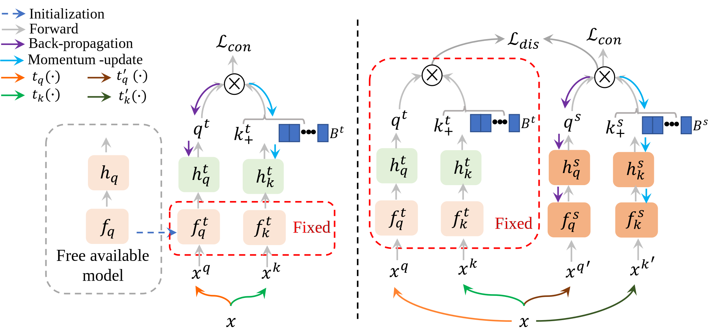

# Free Lunch for Surgical Video Understanding by Distilling Self-Supervisions

## Introduction

This is a PyTorch implementation of MICCAI22 [Free Lunch for Surgical Video Understanding by Distilling Self-Supervisions].

In this papper, we design distill knowledge from publicly available models trained on large generic datasets to facilitate the self-supervised learning of surgical videos.

Framework visualization


## Preparation

## Data Preparation
* We use the dataset [Cholec80](http://camma.u-strasbg.fr/datasets) and [M2CAI 2016 Challenge](http://camma.u-strasbg.fr/m2cai2016/index.php/program-challenge/).

* Training and test data split

   Cholec80: first 40 videos for training and the rest 40 videos for testing.

   M2CAI: 27 videos for training and 14 videos for testing.

* Data Preprocessing: 
1. Using [FFmpeg](https://www.ffmpeg.org/download.html) to convert the videos to frames; 
2. Downsample 25fps to 1fps (Or can directly set the convert frequency number as 1 fps in the previous step); 
3. Cut the black margin existed in the frame using the function of ``change_size()`` in ``video2frame_cutmargin.py``;
```
Note: You also can directly use ``video2frame_cutmargin.py`` for step 1&3, you will obtain the cutted frames with original fps.
```
4. Resize original frame to the resolution of 250 * 250.

* The structure of data folder is arranged as follows:
```
(root folder)
├── data
|  ├── cholec80
|  |  ├── cutMargin
|  |  |  ├── 1
|  |  |  ├── 2
|  |  |  ├── 3
|  |  |  ├── ......
|  |  |  ├── 80
|  |  ├── phase_annotations
|  |  |  ├── video01-phase.txt
|  |  |  ├── ......
|  |  |  ├── video80-phase.txt
├── code
|  ├── ......
```

## Setup & Training

1. Check dependencies:
   ```
   matplotlib==3.4.3
   numpy==1.20.3
   opencv_python==4.5.3.56
   Pillow==9.2.0
   registry==0.4.2
   scikit_learn==1.1.2
   scipy==1.7.1
   termcolor==1.1.0
   torch==1.9.0
   torchvision==0.10.0
   tqdm==4.61.2
   ```
2. Conduct Semantic-preserving training:
   You need first download the pre-trained model for [ResNet50]({https://download.pytorch.org/models/resnet50-0676ba61.pth}) and save it to /IN_supervised
   ```
   CUDA_VISIBLE_DEVICES=0,1,2,3 python main_moco.py   -a resnet50   --lr 0.010   --batch-size 128   --dist-url 'tcp://localhost:10002' --multiprocessing-distributed --world-size 1 --rank 0 --mlp --moco-t 0.2 --aug-plus --cos --method=base --sample_rate=25  --moco-k=2048 --onlyfc
   ```

3. Conduct Pre-training
   ```
   CUDA_VISIBLE_DEVICES=0,1,2,3 python main_moco.py   -a resnet50   --lr 0.010   --batch-size 128   --dist-url 'tcp://localhost:10002' --multiprocessing-distributed --world-size 1 --rank 0 --mlp --moco-t 0.2 --aug-plus --cos --method=base --sample_rate=25  --moco-k=2048 --dis_weight=5 --distill=1
   ```
4. Conduct Linear fine-tuning
   ```
   CUDA_VISIBLE_DEVICES=0 python frame_feature_extractor.py --model=resnet50 --action=train --target=train_set --sample_rate=25 --best_ep=199 --start=1  --end=41 --epochs=10
   ```
5. Exract features
   ```
   CUDA_VISIBLE_DEVICES=0 python frame_feature_extractor.py --model=[The path for the obtained model by step 3] --action=extract --target=train_set --sample_rate=5 --start=1  --end=41 --best_ep=4
   ```
6. Training TCN
   ```
   CUDA_VISIBLE_DEVICES=0 python train.py --action=base_train --sample_rate=5 --backbone=[The path for the obtained model by step 4]
   ```
7. Predict Results
   ```
   CUDA_VISIBLE_DEVICES=0 python train.py --action=base_predict --sample_rate=5 --backbone=[The path for the obtained model by step 5] --best_ep=[the best epoch in Step 5] --fps=5 
   ```

***Evaluate the predcitions***
 ```shell
    matlab-eval/Main.m (cholec80)
    matlab-eval/Main_m2cai.m (m2cai16)
  ```

## Citation
If this repository is useful for your research, please cite:
```
@@article{ding2022free,
  title={Free Lunch for Surgical Video Understanding by Distilling Self-Supervisions},
  author={Ding, Xinpeng and Liu, Ziwei and Li, Xiaomeng},
  journal={arXiv preprint arXiv:2205.09292},
  year={2022}
}
```


